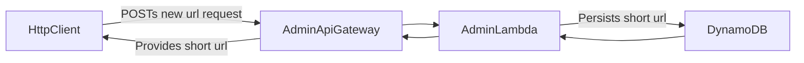
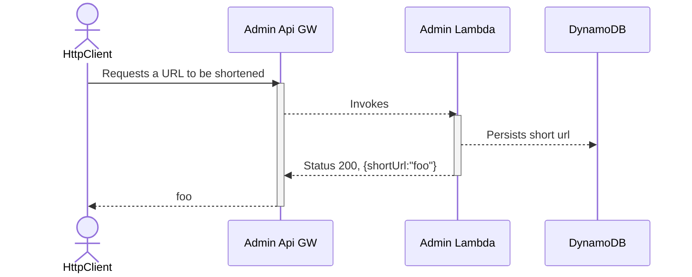

# Architecture

This page shows at a very high level how the Admin API architecture for linkr hangs together, and how the components interact.

## System Design

## Admin Journey - Valid URL

In this example the client has requested a short URL to be generated. The record for this path does not exist in DynamoDB already, and as such the new recorded is persisted! 🚀

