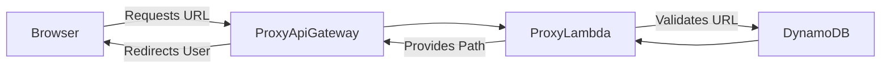
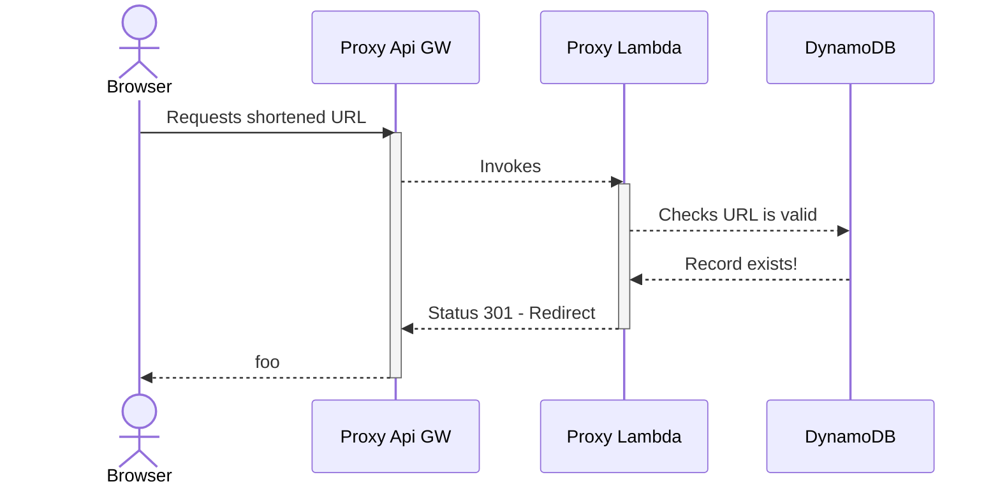
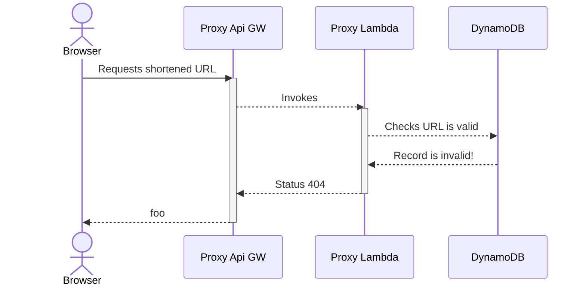

# Architecture

This page shows at a very high level how the proxy architecture for linkr hangs together, and how the components interact.

## System Design

## Proxy Journey - Valid URL

In this example the user has requested a legit URL which has been shortened using the admin API. The record for this path exists in DynamoDB already, and as such the user is able to be redirected to the upstream! 🚀

## Proxy Journey - Invalid URL

In this example the user has requested a nonsense URL has either been mashed into the browser incorrectly or is otherwise malformed. Here, the user gets a 404 error page telling them what a _horrible person_ they are 😞

